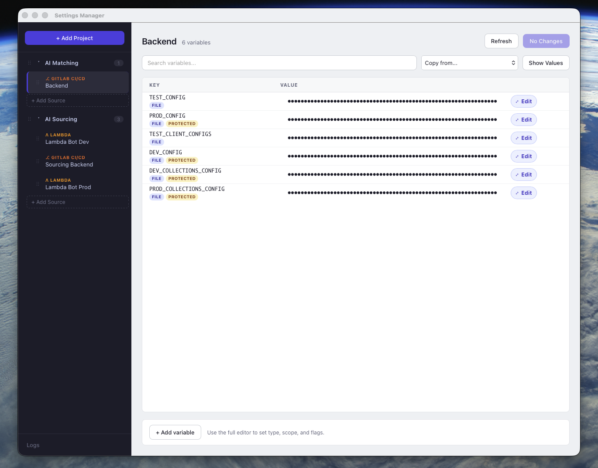
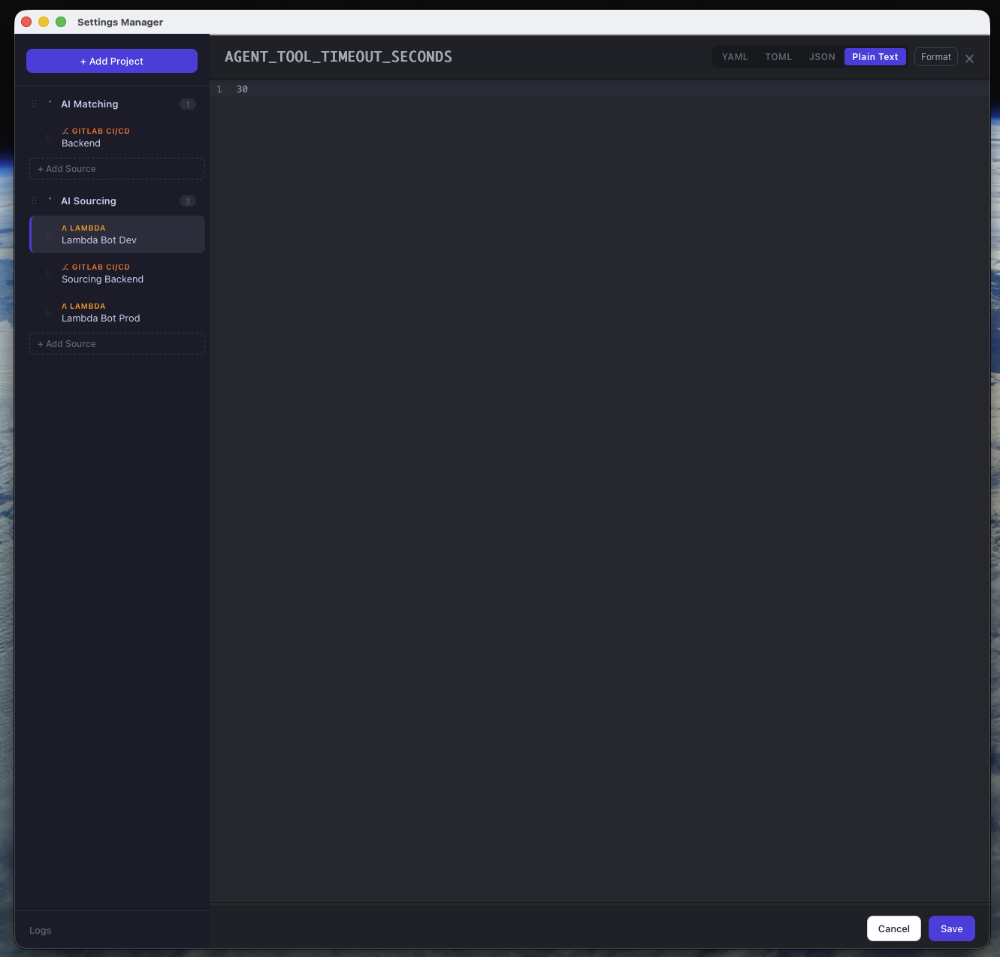
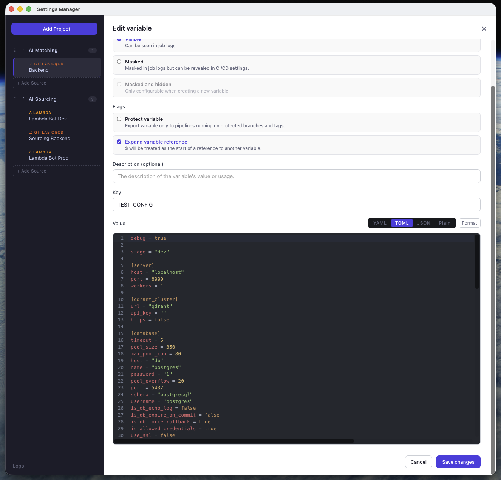
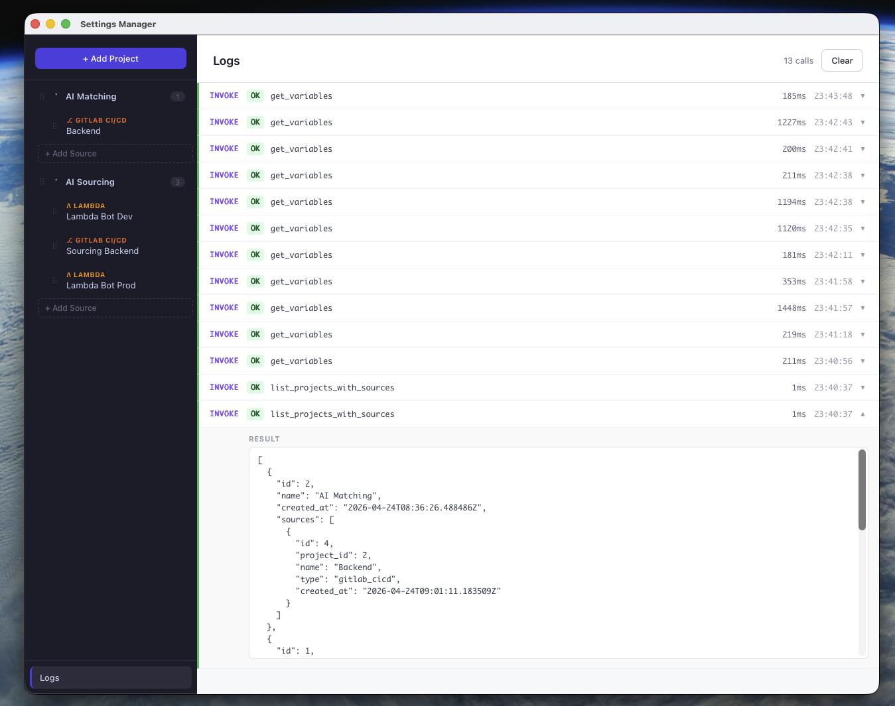

# Settings Manager

Desktop app for editing environment variables across multiple backends without jumping between cloud consoles.

Today it supports:
- AWS Lambda environment variables
- GitLab CI/CD variables

It is built with `Tauri + React + TypeScript + SQLite + Rust`.

## Why This Exists

Most teams end up with variables scattered across:
- multiple Lambda functions
- several GitLab projects
- inconsistent naming and formatting
- fragile copy/paste workflows

`Settings Manager` turns that into one local desktop tool where you can:
- organize sources by project
- inspect variables in one place
- copy values between sources
- edit long values in a real code editor
- work with YAML, TOML, JSON and plain text
- see request logs while debugging provider calls

## Screenshot



## More Screenshots





## Current Feature Set

- Project grouping for sources
- Source ordering and project ordering
- AWS Lambda variable fetch/save
- GitLab CI/CD variable fetch/save
- GitLab-specific fields like scope, protected, masked, hidden, raw and description
- Variable value editor with syntax modes:
  `text`, `yaml`, `toml`, `json`
- Formatting helpers for YAML, TOML and JSON
- Copy variables from one source to another
- Local request log viewer
- Local SQLite persistence for projects and sources

## Tech Stack

- Frontend: `React`, `Vite`, `TypeScript`, `CodeMirror`
- Desktop shell: `Tauri`
- Backend: `Rust`
- Storage: `SQLite` via `rusqlite`
- Providers:
  `AWS Lambda SDK`
  `GitLab REST API`

## Project Structure

```text
src/                 React frontend
src/components/      UI components and editors
src/lib/             frontend API layer, editor helpers, local logs
src-tauri/src/       Rust commands, DB layer, provider integrations
src-tauri/src/db.rs  SQLite schema and persistence
src-tauri/src/providers/
```

## Running Locally

Requirements:
- Node.js 18+
- Rust toolchain
- Cargo
- Tauri system dependencies for your OS

Install dependencies:

```bash
npm install
```

Run the frontend only:

```bash
npm run dev
```

Run the desktop app:

```bash
npm run tauri:dev
```

Build production assets:

```bash
npm run build
```

Build the desktop app:

```bash
npm run tauri:build
```

## Development Notes

- App state for projects and sources is stored locally in SQLite.
- Variable values are fetched live from providers.
- The frontend talks to Rust through Tauri commands in `src-tauri/src/commands.rs`.
- Provider-specific logic lives in `src-tauri/src/providers/`.
- Value editing UX lives mostly in `src/components/VariableEditor.tsx`, `VariableValueEditorModal.tsx`, and `src/lib/codeEditor.ts`.

## Contributing

Contributions are wanted. The repo is already useful, but there is a lot of room to improve the product and polish the workflows.

Good contribution areas:
- new providers
- better diffing and bulk-edit workflows
- safer validation before save
- search/filter improvements
- import/export flows
- onboarding UX for adding sources
- automated tests
- performance work for large variable sets
- packaging and release automation
- better docs and screenshots

## Good First Contributions

- Add empty/loading states with stronger UX
- Improve provider error messages
- Add confirmation or preview before overwriting copied variables
- Add keyboard shortcuts in the value editor
- Add variable diff view before save
- Add source health checks
- Add unit tests for `src/lib/codeEditor.ts`
- Add tests for provider normalization logic
- Add screenshot assets and tighten the README

## If You Want To Add A Provider

A new provider is a strong contribution because the app architecture is already close to the right shape for it.

High-level steps:
1. Add a provider module in `src-tauri/src/providers/`
2. Extend the provider dispatch in `src-tauri/src/providers/mod.rs`
3. Add source configuration fields in `src/components/AddSourceModal.tsx`
4. Normalize provider variables into the shared `Variable` shape
5. Verify save semantics carefully, especially destructive updates

## Product Direction

Areas worth building next:
- provider diff and sync preview
- secret masking and local secure storage improvements
- more providers: Vercel, GitHub Actions, Doppler, Cloudflare, Kubernetes secrets
- import/export and backup
- source templates
- variable history and audit trail

## Known Gaps

- No automated test suite yet
- No release pipeline yet
- Large production bundle on the frontend
- Provider coverage is still intentionally narrow

## License

MIT. See [LICENSE](./LICENSE).
